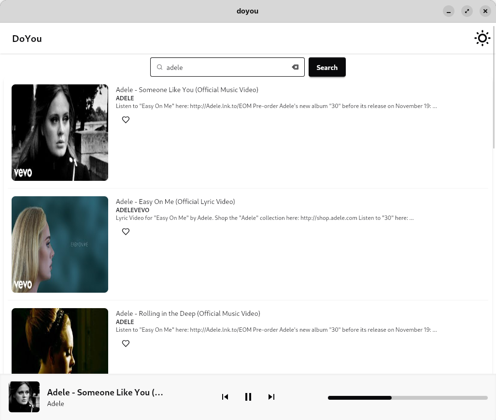
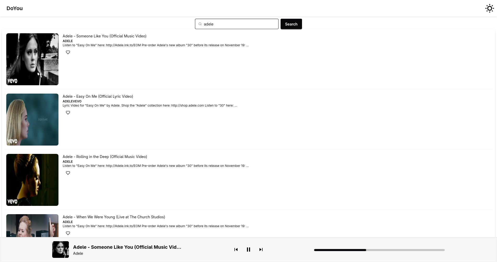
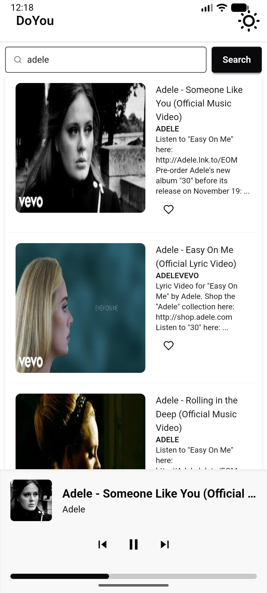

# DoYou - YouTube Music Alternative

DoYou is a desktop application that serves as an alternative to YouTube Music, allowing you to play YouTube videos as audio.

## Features

- Search for YouTube videos.
- Play audio from YouTube videos.
- User-friendly interface.

## Screenshots

<table align="center">
  <tr>
    <td align="center">
      <strong>Desktop</strong> 
      
    </td>
    <td align="center">
      <strong>Web</strong> 
      
    </td>
    <td align="center">
      <strong>Mobile</strong> 
      
    </td>
  </tr>
</table>

## Technologies Used

This project is built with:

- Tauri
- Leptos
- Rust

## Recommended IDE Setup

[VS Code](https://code.visualstudio.com/) + [Tauri](https://marketplace.visualstudio.com/items?itemName=tauri-apps.tauri-vscode) + [rust-analyzer](https://marketplace.visualstudio.com/items?itemName=rust-lang.rust-analyzer).