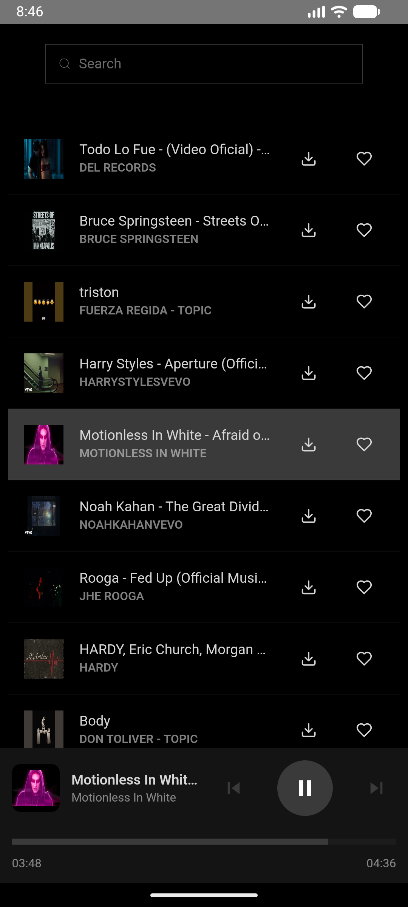
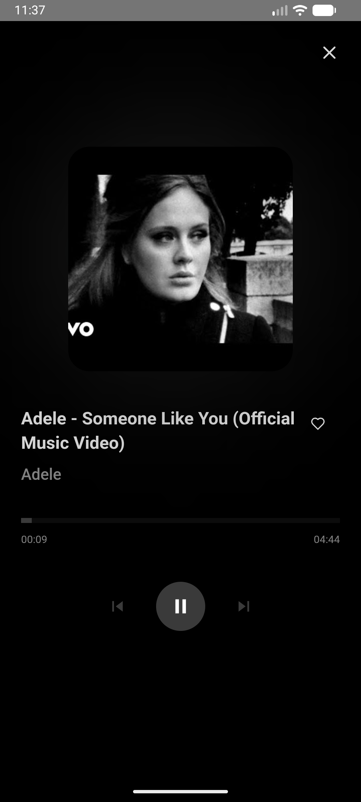
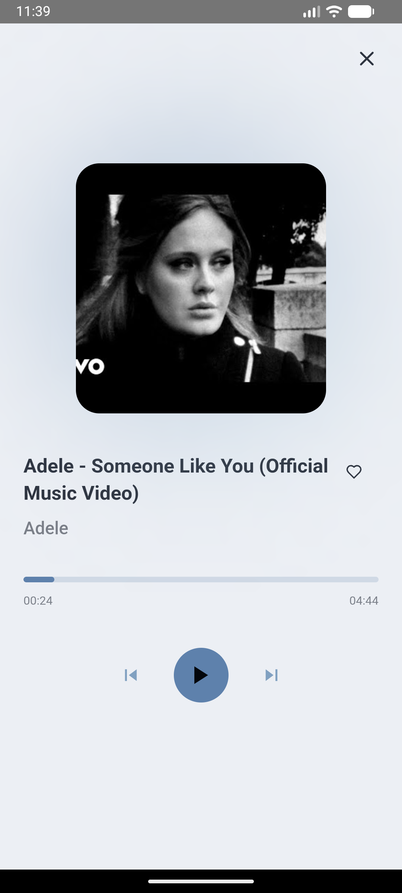

# DoYou

<table>
  <tr>
    <td></td>
    <td></td>
  </tr>
  <tr>
    <td></td>
    <td></td>
  </tr>
</table>

DoYou is a simple desktop application for listening to music from YouTube. This project was created as a way to learn frontend development with Rust using the [Dioxus](httpss.dioxuslabs.com/) framework.

## Getting Started

These instructions will get you a copy of the project up and running on your local machine for development and testing purposes.

### Prerequisites

Before you begin, ensure you have the following installed:

*   [Rust](httpss.www.rust-lang.org/tools/install)
*   [Dioxus CLI](httpss.dioxuslabs.com/learn/0.5/getting_started/desktop) (install with `cargo install dioxus-cli`)

You will also need a Google API key.

### Installation

1.  Clone the repository:
    ```bash
    git clone https://github.com/j03-dev/doyou.git
    cd doyou
    ```
2.  Set up your environment variables. Create a `.env` file in the root of the project and add your Google API key:
    ```
    GOOGLE_API_KEY=your_api_key_here
    ```
3.  Run the application:
    ```bash
    dx serve
    ```
    This will start the development server and open the application.

## Development Notes

This project uses [Tailwind CSS](httpss.tailwindcss.com/) for styling. The Dioxus CLI automatically handles the Tailwind CSS build process.
